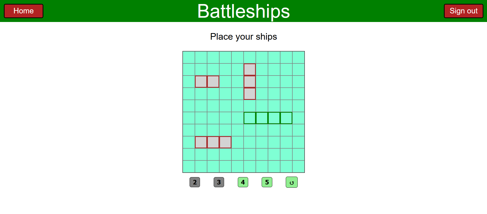
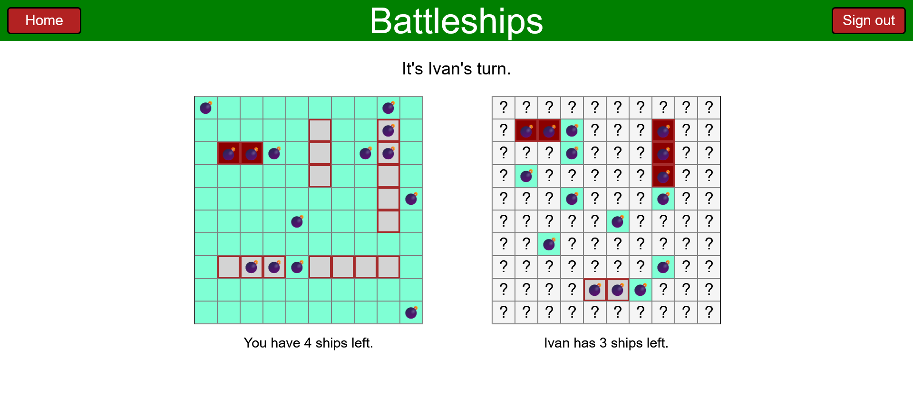
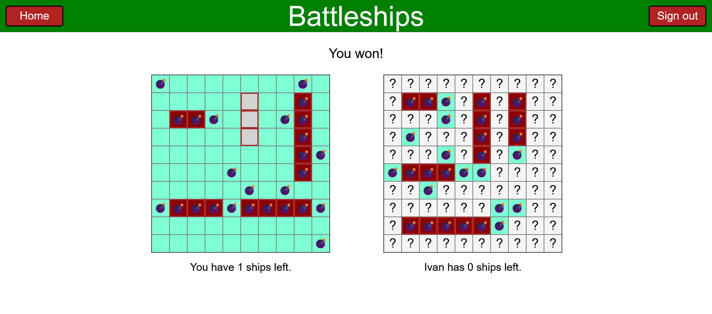
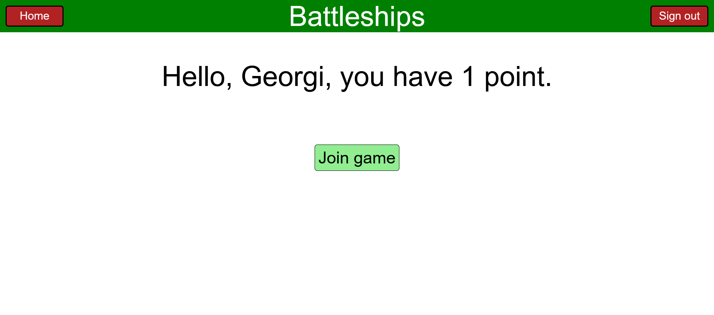

# Battleships
Simple multiplayer implementation of the game Battleships, using HTML, CSS, JS, Express and WebSockets  
https://en.wikipedia.org/wiki/Battleship  

In order to play start the server with 'node app.js'  
A player can't play with himself. Use two different browsers each with different logged account to play using one computer. 

Screenshots:

